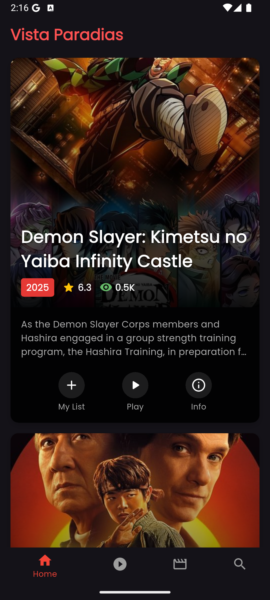

# VistaParadias Flutter Movie App 🎥

A Flutter-based movie application that provides users with the latest movies, TV shows, and search functionality. This app is designed to deliver a seamless and visually appealing experience for movie enthusiasts.

## Features ✨

- **Now Playing Movies**: Browse the latest movies currently playing in theaters.
- **TV Shows**: Explore popular TV shows.
- **Search**: Search for movies and TV shows by title.
- **Movie Details**: View detailed information about movies, including cast, synopsis, and ratings.

## Screenshots 📸


## Installation 🚀

1. Clone the repository:
   ```bash
   git clone https://github.com/ruvindu-dulaksha/VistaParadias-Flutter-Movie-App.git
2. Navigate to the project directory:
    ```bash
        cd movie_app
3. Install dependencies:
    ```bash
        flutter pub get
4. Run the app:
    ```bash
        flutter run

## Folder Structure 🗂️

lib/Pages: Contains the main pages of the app (e.g., Home, Now Playing, Search, TV Shows).
lib/models: Data models for movies and TV shows.
lib/service: Handles API calls and data fetching.
lib/widgets: Reusable UI components like movie details.

## Requirements 📋

Flutter SDK
Dart SDK
Android Studio or Xcode for emulators

## Contributing 🤝
Contributions are welcome! Feel free to open issues or submit pull requests.

## License 📄
This project is licensed under the MIT License. See the LICENSE file for details.

## Acknowledgments 🙌
The Movie Database (TMDb) for providing movie and TV show data.
Flutter community for their amazing resources and support.
